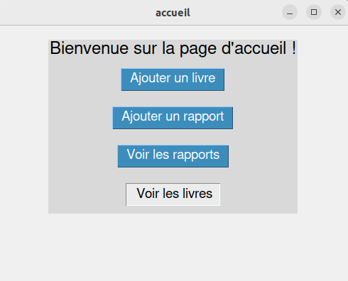
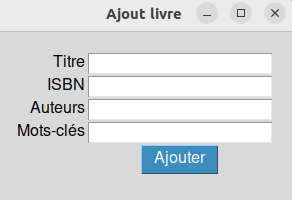
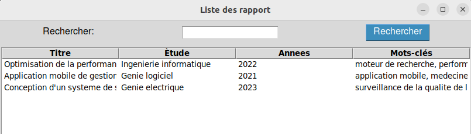
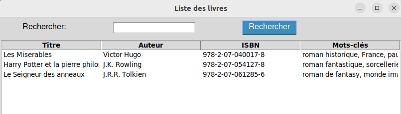

# tkinter_XML
An application using Python for managing books and reports in a library, utilizing an XML database.
Projet XML
# Présentation générale:
Ce projeProjet XML
# Présentation générale:
Ce projet consiste en une application créée en utilisant le langage **Python** avec les bibliothèques **tkinter**, **os** et **xml**. Elle comporte 4 interfaces :

- Accueil:

 

- Ajout de livre:

- Ajout de rapport:

- Vue des livres disponibles avec fonction de recherche:

- Vue des rapports avec fonction de recherche:

Toutes ces interfaces communiquent avec une base de données de type **XML**.

# Fichier XML (bib.xml):
Le fichier XML représente une base de données bibliographique avec des informations sur les livres et les rapports de projets de fin d'études (PFE). Voici un résumé des éléments présents dans le fichier :

- La section "livres" contient des informations sur plusieurs livres, notamment leur titre, auteur, numéro ISBN et mots-clés associés.
- Chaque livre est représenté comme un élément "livre" avec des éléments enfants tels que "titre", "auteurs", "ISBN" et "mots\_cle".
- La section "rappots\_pfe" contient des informations sur les rapports de projets de fin d'études, y compris leur titre, domaine d'étude, année et mots-clés associés.
- Chaque rapport de PFE est représenté comme un élément "rapport" avec des éléments enfants tels que "titre", "etude", "annees" et "mots\_cles".
- Les mots-clés sont représentés comme des éléments "mot\_cle" qui sont regroupés dans un élément "mots\_cles" pour les livres et les rapports de PFE.
- Certaines balises contiennent des attributs, tels que l'attribut "nb" dans l'élément "auteurs" pour indiquer le nombre d'auteurs d'un livre.

# Fichier DTD (bib.dtd):
Le fichier DTD (Document Type Definition) fourni définit la structure et les règles de validation pour un fichier XML représentant une bibliothèque avec des livres et des rapports de projet de fin d'études (PFE). Voici une description des éléments et attributs définis dans le DTD :

- L'élément racine est "bib", qui contient deux sous-éléments : "livres" et "rappots\_pfe".
- L'élément "livres" contient un ou plusieurs éléments "livre".
- L'élément "livre" contient les sous-éléments suivants : "titre", "auteurs", "ISBN" et "mots\_cle".
- L'élément "titre" contient du texte (#PCDATA), c'est-à-dire qu'il peut contenir n'importe quelle donnée texte.
- L'élément "auteurs" contient un ou plusieurs éléments "auteur".
- L'élément "auteur" contient du texte (#PCDATA) et représente le nom d'un auteur.
- L'attribut "nb" de l'élément "auteurs" est de type CDATA et est requis (#REQUIRED).
- L'élément "ISBN" contient du texte (#PCDATA) et représente un code d'identification pour un livre.
- L'élément "mots\_cle" contient un ou plusieurs éléments "mot\_cle".
- L'élément "mot\_cle" contient du texte (#PCDATA) et représente un mot clé associé à un livre.
- L'élément "rappots\_pfe" contient un ou plusieurs éléments "rapport".
- L'élément "rapport" contient les sous-éléments suivants : "titre", "etude", "annees" et "mots\_cles".
- L'élément "etude" contient du texte (#PCDATA) et représente le domaine d'étude d'un rapport de PFE.
- L'élément "annees" contient du texte (#PCDATA) et représente l'année d'un rapport de PFE.
- L'élément "mots\_cles" contient un ou plusieurs éléments "mot\_cle", qui sont similaires à ceux définis précédemment.
- L'élément "bib" est également défini comme contenant du texte (#PCDATA), ce qui signifie qu'il peut contenir n'importe quelle donnée texte.

